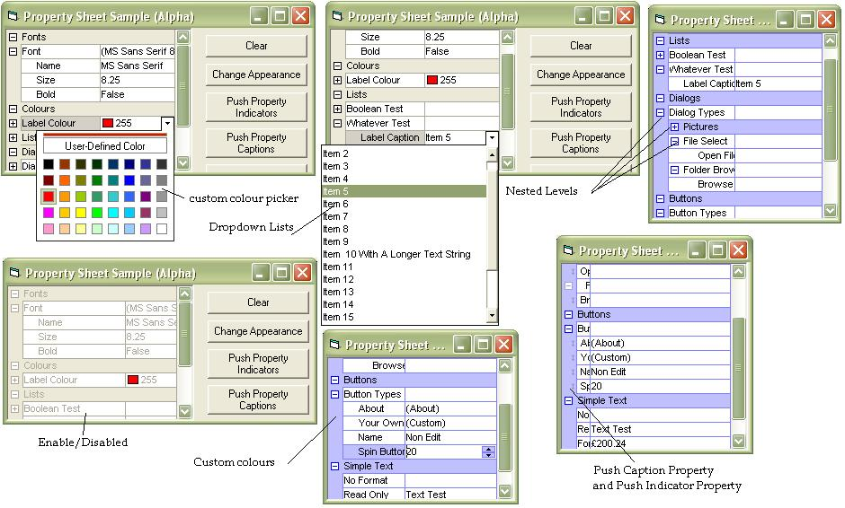



## VSNet Property  Tree \(Alpha\)

### Description

A Fully Ownerdrawn Implemetation Of A VSNet Style Property Tree (Supporting Nested Levels).

Supports: Picture Object,Common Dialogs (Open,Browse etc), Font Object, Custom Lists,Spin Button, Nested Levels blah blah blah....

There Is No Calander Support As Yet But You Can Format Each Property Item and Validate It Before Updateing.

Caveats: No For Each Suuport And No Delete On Property Items But you Can Clear and Reload.

List Only Need To Be Created Once and And As Many Property Item(s) you Like Can Be Pointed To It.

I'm Not Going To Bore You With Anymore Details, Check The Screen Shot And download The Code.

A Big Thanks Goes To Paul Caton For the Hook Code, Vlad Vissoultchev For The Drawing Code, Fred Cpp For The isButton And Carles PV For His Coolist.

Notes Before Use: You Must Copy The WinsubHook2.tlb To Your System Folder.

As Always Comments and Constructive Critism Is Always Welcome.

The Sample Included Is A Basic Sample But I Will Update When I have More Time.

Note: This Has Only Been Tested On XP Pro And Home SP2 I Would Like To Know If It Works On Other Os's

Kind Regards

Gary
 
### More Info
 

             |
---                |---
**Submitted On**   |2005-05-01 19:20:00
**By**             |[Phantom Man](https://github.com/Planet-Source-Code/PSCIndex/blob/master/ByAuthor/phantom-man.md)
**Level**          |Advanced
**User Rating**    |5.0 (140 globes from 28 users)
**Compatibility**  |VB 6\.0
**Category**       |[Custom Controls/ Forms/  Menus](https://github.com/Planet-Source-Code/PSCIndex/blob/master/ByCategory/custom-controls-forms-menus__1-4.md)
**World**          |[Visual Basic](https://github.com/Planet-Source-Code/PSCIndex/blob/master/ByWorld/visual-basic.md)
**Archive File**   |[VSNet\_Prop188382522005\.zip](https://github.com/Planet-Source-Code/phantom-man-vsnet-property-tree-alpha__1-60265/archive/master.zip)

